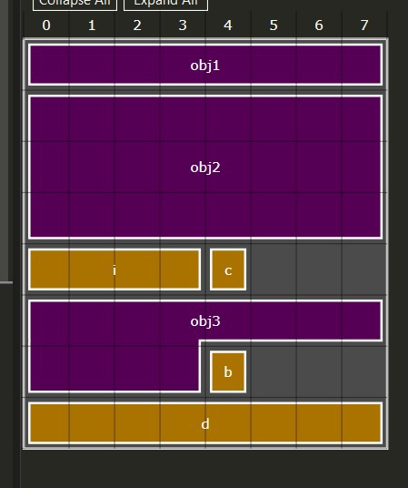

## Задача 1
Да се напише програма, която прочита от конзолата матрица с размер `NxM` и след това имплементирайте функция, която:
 - приема матрицата и връща нова транспонирана матрица.
 - разменя местата на два реда - първи с последен, втори с предпоследен и тн. (напишете ваша swap функция)
 - отпечатва матрицата
   
> __Указания.__
> Да се използва динамично заделяне на памет. <br />


Пищов: <br />

* Операцията транспониране се нарича едно от следните действия:

* Обръщането на `A` по главния ѝ диагонал;
* Записването на редовете на `A` като стълбове (колони) на A^T;
* Записването на стълбовете (колоните) на `A` като редове на A^T.

# Структури
# Задача 2
Пресметнете и проверете чрез оператора `sizeof` колко е големината на следните структури.
```c++
struct empty {
};

struct test1 {
	int number;
};

struct test2 {
	char symbol;
	int number;
};

struct test3 {
	char symbol;
	short sh;
	int number;
};

struct test4 {
	char symbol1;
	int number;
	char symbol2;
};

struct student {
	char* name;
	int* grades;
};

struct test5 {
	char a[5];
	int b;
	double c;
};

struct test6 {
	char a[3];
	short b;
	double c[4];
	char d;
};
```
```c++
struct A
{
	double c;
	char b; 
};

struct B
{
	char c;
};

struct C
{
	A obj;
	B obj2;
};
```
```c++
struct A
{
	double c;
	char b;
	int k;
	char s;
};

struct B
{
	int a;
	char c;
	char d;
	float f;
};

struct C
{
	char arr[3];
	float f;
};

struct D
{
	C obj1;
	A obj2;
	int i;
	char c;
	B obj3;
	bool b;
	double d;
};
```
На снимката е показано подравняването на горната структура `struct D`




```c++
struct A
{
	int a;
	char b;
};

struct B
{
	char c;
};

struct C
{
	char f;
	A obj;
	B obj2;
	double d;
};
```
На снимката е показано подравняването на горната структура `struct C`


# Задача 3
Да се създаде структура която представя комплексно число.

Създайте функция, която събира две комплексни числа.

Създайте подходяща функция за извеждане принтиране на комплексни числа.

# Задача 4
Да се напише програма, която да моделира точка (структура `Point`) в декартовата равнина.

Да се имплементира следната функционалност:

* `Point` да може да се прочита от стандартния вход.
* `Point` да може да се отпечатва на стандартния изход в подходящ формат.
* Да може да се намира разстоянието от центъра на равнината (0.0, 0.0) до дадена точка.
* Да може да се намира разстояние между две точки.

Бонус:
* По дадена точка, да се определи в кой квадрант е.
* По дадена окръжност с радиус r и център началото на координатната система, да се изведе дали точка K е в тази окръжност или по нейния контур.

# Задача 5
Една група се състои от краен брой студенти, като броят на студентите се задава от вас. Всеки студент се характеризира с оценка, фн и име.

Създайте структура, която описва група. Структурата също така трябва да пази средния успех на групата.

* Направете функция, която създава група, вземайки информация от стандартния вход. Средния успех трябва да се сметне след въвеждане на информацията.
* Напишете функция, която приема група и минимален успех за стипендия, и връща колко студента ще получават стипендия.
* Създайте функция, която приема група и минимален успех за стипендия и извежда сортирани всички студенти, които ще получават стипендия идния семестър.(Сортирането искаме да бъде оптимално)

Бонус:
* Използвайки сортираните студенти от предходната точка, напишете функция, която приема група и фн и връща дали даден студент е в групата (Възможно най-оптимално)
